## Hagelandse 101

9月4日晚上从leuven 火车站出发的100km 徒步. 报名时最初的想法或许只是因为一直失眠无法睡觉, 想要找个机会把自己累到崩溃,然后就可以安心睡觉了. 
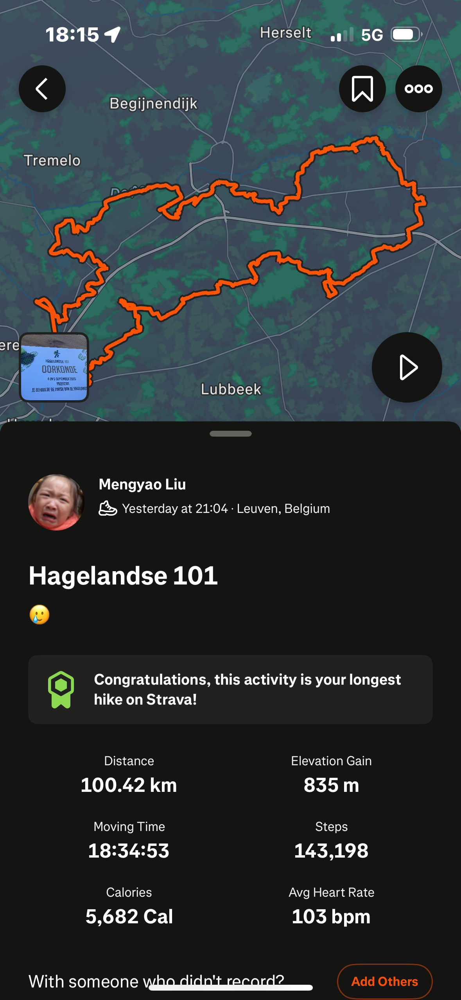{ .diary-photo width="400" }
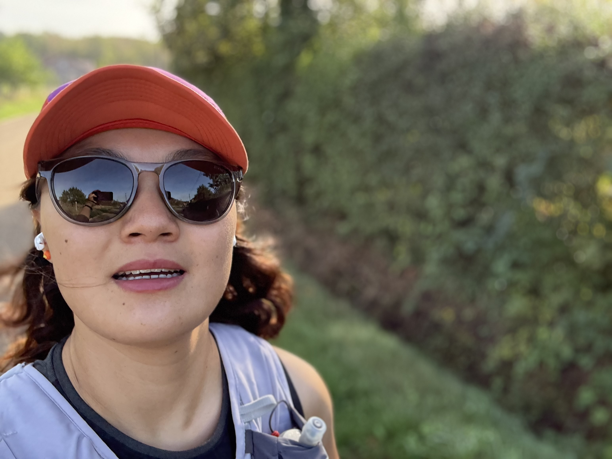{ .diary-photo width="400" } 
因为出发之前告诉了0824, 说自己有点害怕.他安慰了我,还说给我加油. 因为他说给我加油,我以为他会一直关心我,我等了一夜他的信息, 仍然记得第二天早上的时候他只发了一句,走完了吗? 我太天真了,我以为他会像是我想象的哥哥一样,没有啦,都是假的嘛. 

和组里一起跑步来着 
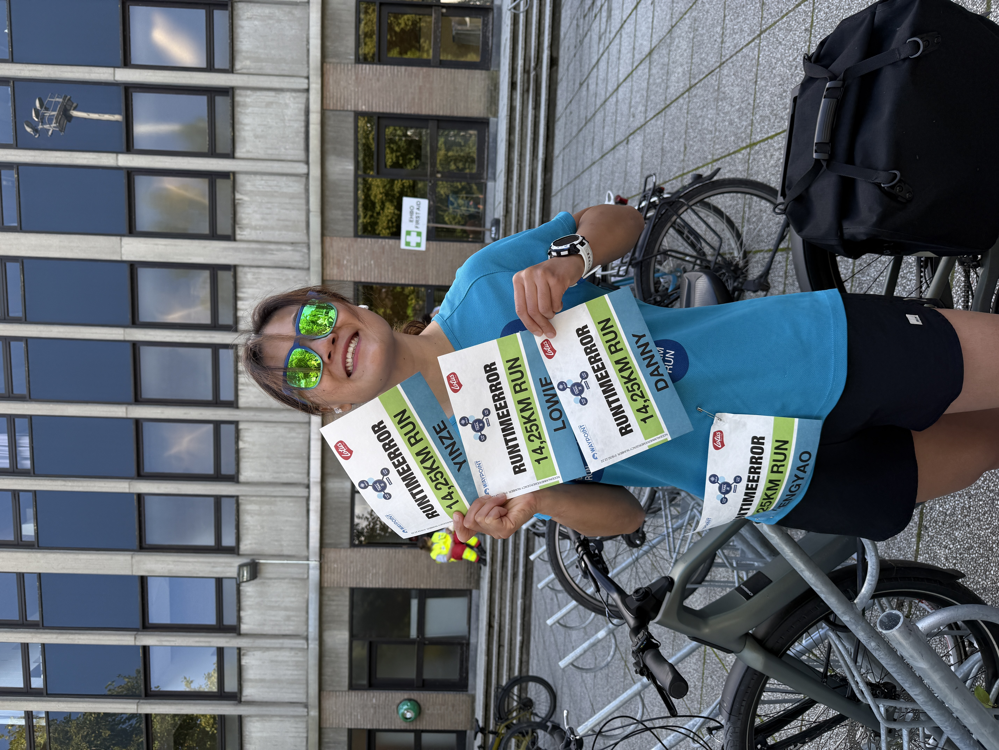{ .diary-photo width="400" }  
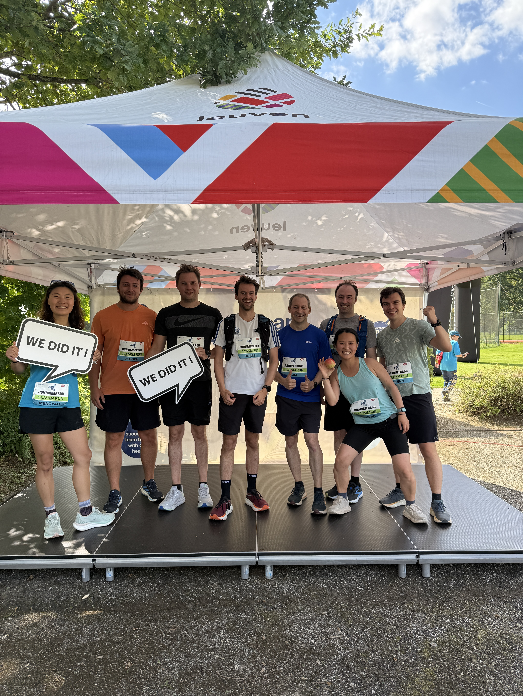{ .diary-photo width="400" }  

## ICRA 2027 SEth sumbmission
我觉得自己做的不够好, 但这次也真的一个人在很努力了. 我愿接受所有的结果, 希望一切都好. 很害怕真的很害怕.
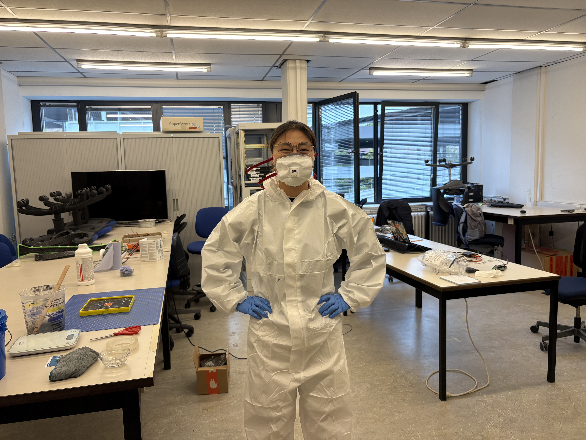{ .diary-photo width="400" }  
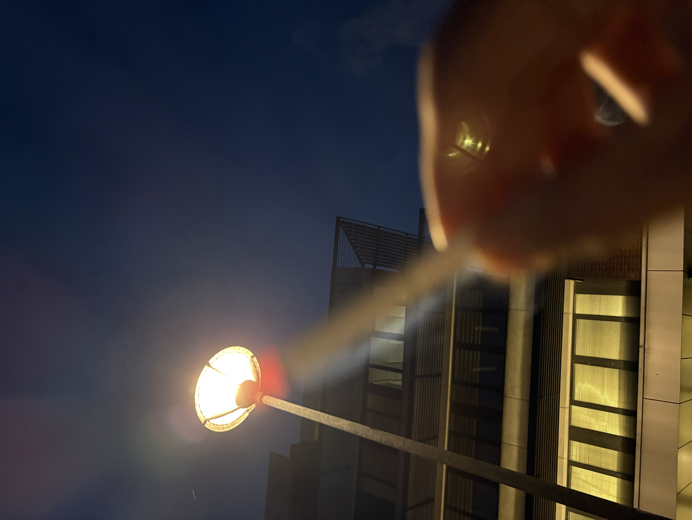{ .diary-photo width="400" }   

## 敦刻尔克骑行事故
上周终于把最后的视频也提交了,虽然很辛苦甚至觉得做的也不是很好,但不管怎么说都这样结束了,小刘也没有退缩. 原本计划了完美周末,当然对我来说. 周六早上骑车从奥斯坦德出发到敦刻尔克,然后休息半天. 第二天早上跑一场啤酒马拉松. 我总是想要用这种极端的方式来来放松,因为我知道一旦我停下来,读书看影做所有的事情里都会有0824的影子,我好像生病了.

骑行事故 大概就是快到敦刻尔克的时候,一个超级急转弯, 我侧弯摔倒了. 不知道是不是上帝的意思,上帝觉得我不适合跑马拉松. 第二天还是放弃了马拉松, 其实没有那么糟糕啊. 自己做饭, 去海边遛弯, 吃到了好吃的冰淇淋. 也很希望有一个人陪着我, 可是没有啊. 还是自己一个人嘛. 也还是十分想念0824, 要是他能陪着我在海边就好了. 可是啊 就像是在维也纳一样,就算他在身边又如何呢? 
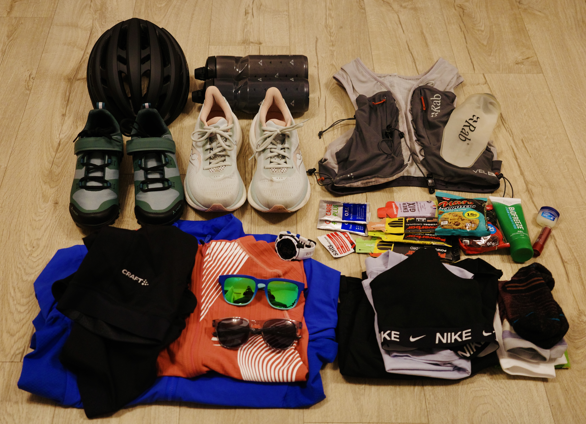
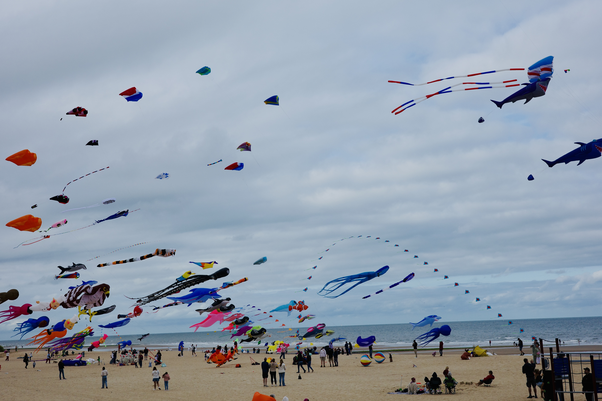 
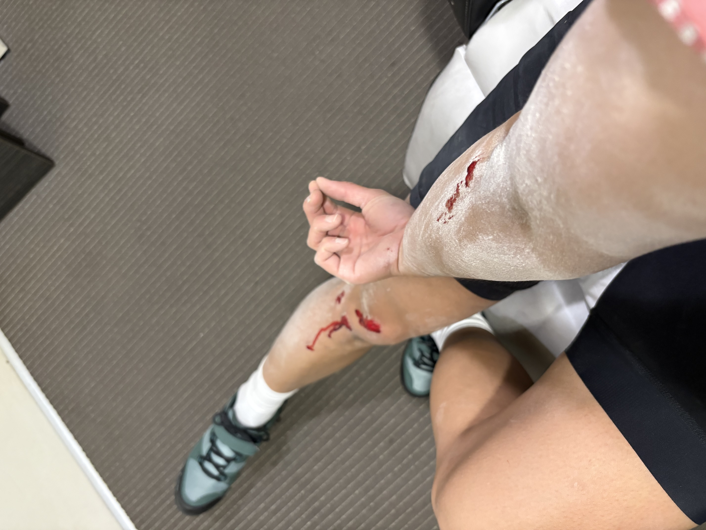{ .diary-photo width="400" }  
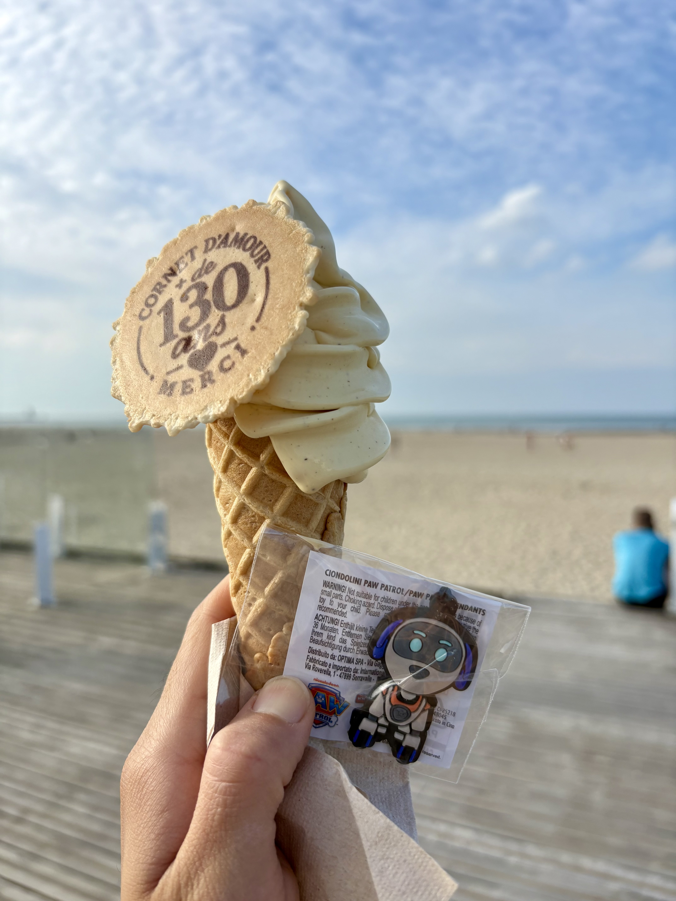{ .diary-photo width="400" }   
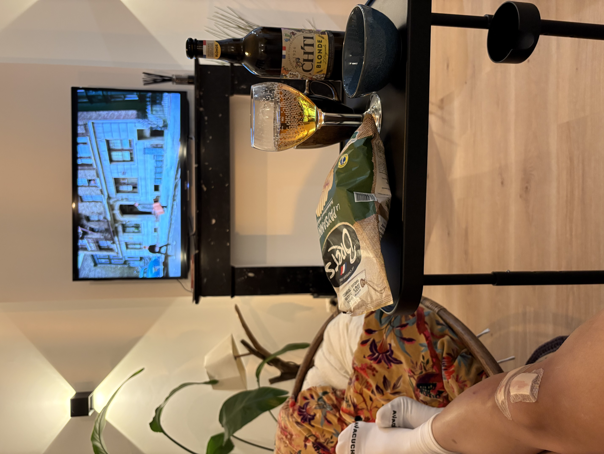  { .diary-photo width="400" }    
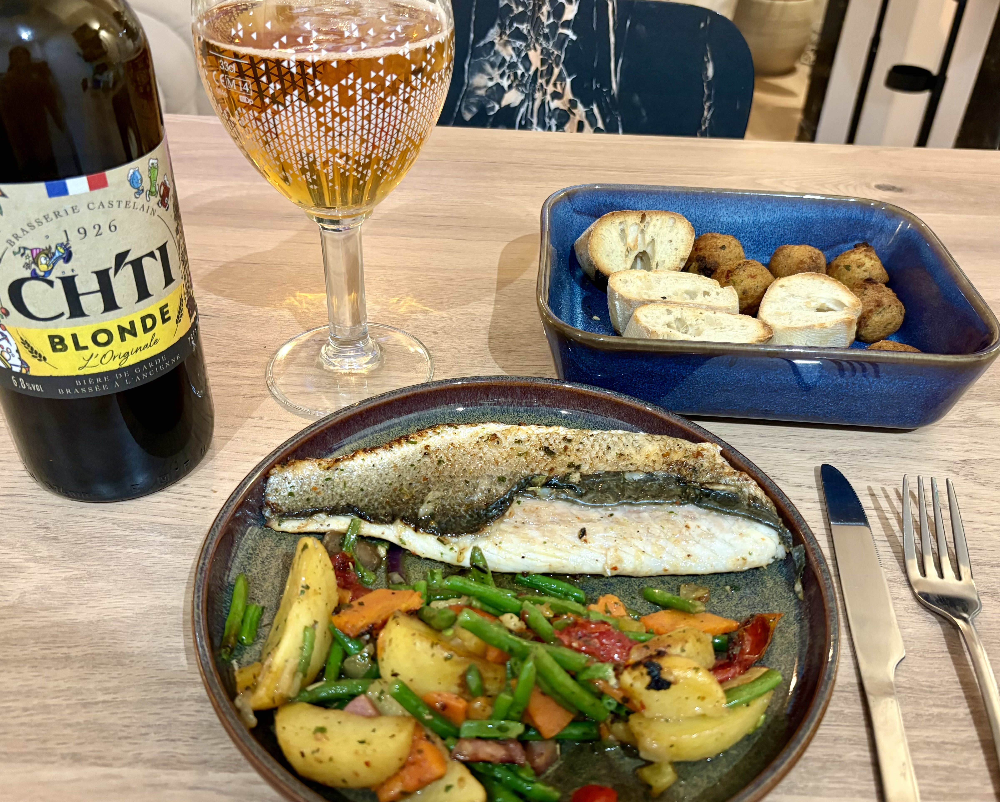 {.diary-photo width="400" }   

## 0824 和 其他人
在生活里的每个角落里都有他, 我逃避他,靠近他,怨恨他,思念他,这一切都还是一如既往地充斥着我的生活.我没有办法彻底剥离他的存在, 我也不知道该怎么办? 就像是昨晚上回复他的信息,竟然没出息地说出来了,想和他视频. 他会拒绝我的,我想, 他故意不回复,我也没有勇气去点开看他的信息.我不理解自己,我还是很思念他,我完全不知道该怎么才能放下他,我试过了我想象的一切办法. 我原本想象的他会同意和我视频,我想我错了,他已经下定决心不再见我了,不想要再看见我了,我怎么能奢望他心软呢. 

我明明很恨他,在dayone 里不止一次地发火说那些刻薄至极的话,甚至诅咒的话对他.但我大部分时间又如同病态一般地奢望他的出现,我想我生病了, 是真的生病了.我以为9月过去一切都好起来了,我能继续向上爬,我会坚信我的人生里还有一个真的哥哥在等着我,可是我还是做不到,我被自己的无能惊呆了. 

另一件事, 突然想起来了就是我还是很喜欢 也很在意Hans,好像有他楼里的时候,我的脑子里就没有那么多0824. 他年龄也很大啊. 但是他是单身啊啊. 可是不知道怎么和他说话, 也不知道怎么开始.感觉他不喜欢我吧, 我喜欢看他的眼睛,很喜欢. 算了算了. 可能就是没有特别的缘分彼此,anyway 不能再让自己受伤了,0824 已经很难了. 我在想或许我还是会开心遇到新的人, 或许会遇到新的自己也会喜欢的人. 我真的很在意hans, 我好希望他能走进我的办公室, 来问我要不要下班一起去喝一杯. 他可能觉得我不是正确的人吧, 好希望你也喜欢我. 想抱抱你,我好喜欢抱抱啊.  hans或许觉得我就是神经病吧, 我也没有办法. 感觉他有女朋友了,哈哈,这是好事情啊啊, 他从来没有伤害过我, 我会希望他幸福. 不要喜欢这样的人, 我还是会受伤, 他们会比较我. 不要再犯傻了, 或许永远碰不到一个人很喜欢我, 但是我希望你可以爱着自己,更爱自己.  (我真的好多碎碎念啊) 

有一天,我有自己的哥哥呢就好啦, 就没有那么孤单了. 不知道今天晚上会不会和0824视频, 我不知道该怎么面对他.喜欢一个人到底是怎么样的啊, 被人喜欢又是什么样的? 我的意思是真的被人喜欢是什么样呢? 
还有一件事 或许不是那么开心, 就是jonathan 莫名其妙地消失, 不知道为什么. 算了我也没有伤害过他. brendan 今天这个月底就离开比利时了, yinze 这个月也答辩结束了, 好像身边的人都会离开. 

九月份的最后一天和0824视频了，可能80%的时间都是我在说话。我也不知道该如何释怀,假装一切都没有发生过。怎么会呢？  但也没有什么不可以的不是吗？ 

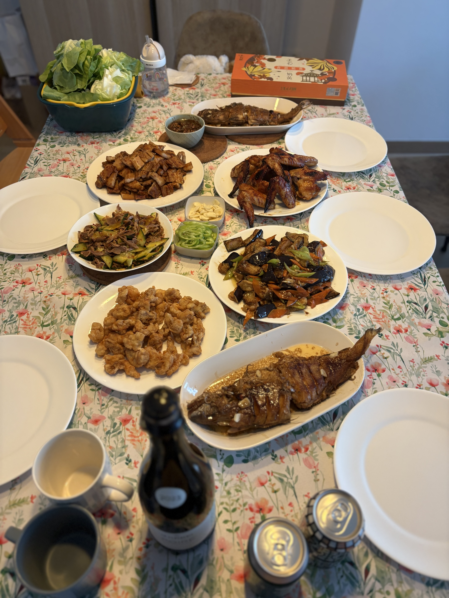{.diary-photo width="400" }   
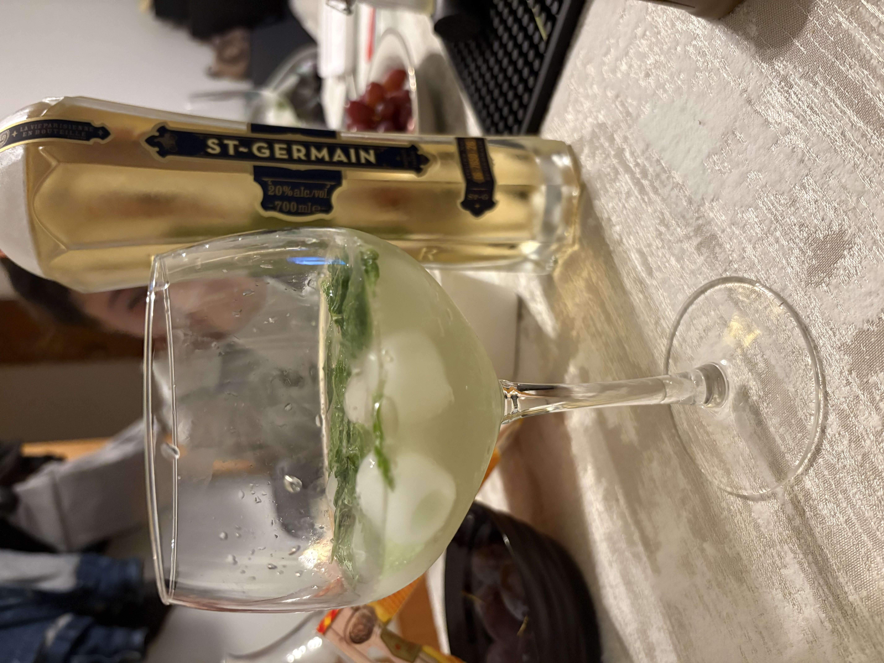